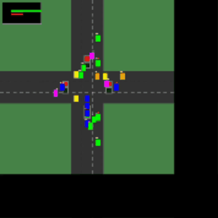

# Traffic Simulator

---


---

## Assignment Information

**Assignment Number:** Assignment 1 - Queue Data Structure Implementation  
**Course:** Data Structures and Algorithms  
**Student Name:** Aashutosh Karki  
**Roll Number:** 33  
**Semester:** 3rd Semester  
**Date of Submission:** December 28, 2025  

---

## 1. Project Overview

A comprehensive four-way traffic junction simulation system implementing queue data structures to manage vehicle flow, turning behavior, and intelligent signal control. This enhanced version builds upon the basic traffic simulator by adding realistic vehicle turning, priority-based signal timing, and dynamic traffic management.

The system visualizes real-time traffic movement using SDL2 graphics library, demonstrating practical application of linear data structures in solving complex real-world problems.

---

## 2. Objectives

- Implement FIFO queue data structures for managing 12 traffic lanes  
- Simulate realistic vehicle turning behavior (straight, left, right)  
- Visualize traffic flow with proper signal compliance and stopping rules  
- Implement dynamic signal timing based on traffic density  
- Create priority-based traffic control for congested lanes  
- Demonstrate continuous vehicle generation with random turn assignments  
- Provide file-based external control of traffic parameters  

---

## 3. System Architecture

### 3.1 Road Network Design

The simulation models a complete four-way intersection with perpendicular roads:

**Road Layout:**
- **Road A:** North-South direction (Top → Bottom)
- **Road B:** South-North direction (Bottom → Top)  
- **Road C:** East-West direction (Right → Left)
- **Road D:** West-East direction (Left → Right)

**Lane Configuration (per road):**
- **Lane 1:** Right lane - Can turn right or go straight
- **Lane 2:** Middle lane - Signal-controlled, must stop at red
- **Lane 3:** Left lane - Left-turn only lane

---

### 3.2 Vehicle Behavior System

**Vehicle Attributes:**
- Road identifier (A, B, C, D)
- Lane number (1, 2, 3)
- Position coordinates (x, y)
- Target coordinates for turning
- Speed and movement angle
- Turning direction (STRAIGHT, LEFT, RIGHT)
- Waiting time counter

**Turning Rules:**
- Lane 1: Random assignment of LEFT, RIGHT, or STRAIGHT
- Lane 2: STRAIGHT only (signal-controlled)
- Lane 3: LEFT turn only

**Movement Logic:**
- Path following with smooth trajectory
- Proper stopping at red signals (Lane 2 only)
- Speed adjustment based on traffic conditions
- Automatic removal after exiting simulation area

---

### 3.3 Queue Implementation

**Data Structure Design:**
- 12 separate FIFO queues (3 lanes × 4 roads)
- Linked list implementation for dynamic sizing
- Maximum capacity: 20 vehicles per lane
- Queue naming convention: [Road][Lane] (e.g., AL1, BL2)

**Queue Operations:**
- Enqueue: Add vehicle to lane queue
- Dequeue: Remove vehicle after crossing
- Count tracking for statistical analysis
- Front/rear pointer management

---

### 3.4 Traffic Signal System

**Signal States:**
- ALL_RED: All vehicles in Lane 2 must stop
- A_GREEN: Road A vehicles can proceed
- B_GREEN: Road B vehicles can proceed  
- C_GREEN: Road C vehicles can proceed
- D_GREEN: Road D vehicles can proceed

**Signal Control Logic:**
- Only one road has green signal at a time
- Left-turn vehicles can proceed when perpendicular road is green
- Signal timing dynamically adjusted
- Priority mode for congested lanes

---

### 3.5 Dynamic Timing Algorithm

**Green Time Calculation Formula:**
|V| = (1/n) × Σ|Lᵢ|

Where:
- n = Number of normal lanes (BL2, CL3, DL3 = 3)
- |Lᵢ| = Vehicle count on i-th lane
- |V| = Number of vehicles served per cycle

**Total Green Time:**
Total Green Time = |V| × t
Where t = Time per vehicle (100ms base value)

**Timing Range:**
- Minimum: 2000 milliseconds
- Maximum: 5000 milliseconds
- Dynamic adjustment based on traffic density

---

### 3.6 Priority Control System

**Normal Mode:**
- All roads served equally using dynamic timing
- Sequential signal rotation: A → B → C → D
- Based on calculated green times

**Priority Mode:**
- Activated when AL2 lane has >10 waiting vehicles
- Road A gets immediate green signal
- Continues until AL2 count drops below 5
- Ensures congestion relief on high-traffic lanes

---

### 3.7 Vehicle Generation System

**Spawn Mechanism:**
- Continuous random spawning (20% chance per lane per second)
- Lane-specific vehicle placement
- Random turn assignment based on lane rules
- Initial position calculation based on road and lane

**External Control:**
- 12 text files (AL1.txt through DL3.txt)
- File reading every 3 seconds
- Vehicle count updates from external sources
- Flexible traffic density control

---

## 4. Visual Features

### 4.1 Color Coding System

- **Red:** AL2 lane in priority mode (>10 vehicles)
- **Green:** Lane 3 (left-turn only vehicles)
- **Blue:** Lane 2 (signal-controlled straight vehicles)
- **Yellow:** Lane 1 vehicles going straight
- **Orange:** Lane 1 vehicles turning left
- **Magenta:** Lane 1 vehicles turning right

### 4.2 Visual Indicators

- **Turning Indicators:** White rectangles showing turn intention
- **Waiting Indicators:** Red dots on stopped vehicles
- **Traffic Lights:** Four signal lights at junction approaches
- **Statistics Panel:** Real-time traffic data display
- **Lane Markings:** Clear road and lane markings

### 4.3 Display Elements

- **Road Network:** Grass background with gray roads
- **Lane Divisions:** White dashed lane markings
- **Traffic Signals:** Red/Green lights at each approach
- **Vehicle Shapes:** Rectangular vehicles with color coding
- **Info Panel:** Black semi-transparent stats overlay

---

## 5. Technical Implementation

### 5.1 Data Structures

**Vehicle Node Structure:**
```c
typedef struct VehicleNode {
    int id;
    char road;
    int lane;
    float x, y;
    float speed;
    float target_x, target_y;
    float angle;
    int waiting;
    int has_turned;
    TurnDirection turn;
    struct VehicleNode* next;
} VehicleNode;
Lane Queue Structure:

c
typedef struct {
    VehicleNode* front;
    VehicleNode* rear;
    int count;
    char name[4];
    int last_spawn_time;
} LaneQueue;
Traffic Signal Structure:

c
typedef struct {
    SignalState state;
    int timer;
    int green_time;
    char current_road;
    int priority_mode;
} TrafficSignal;


## 5.2 Management Threads

###  Signal Control Thread
- Independent thread for traffic light timing  
- 100 ms update interval  
- State transition management  
- Priority mode detection  

### Main Thread
- Graphics rendering at **60 FPS**  
- Vehicle movement updates  
- File I/O operations  
- User input handling  

---

## 5.3 Key Functions

###  Core Functions
- **addVehicleToLane()** – Adds vehicle to the appropriate queue  
- **removeVehicleFromLane()** – Removes vehicle after crossing  
- **shouldStopAtRed()** – Determines whether a vehicle must stop  
- **calculateTurnPosition()** – Calculates turning trajectory  
- **updateSignal()** – Updates traffic signal state  
- **calculateFormula()** – Computes dynamic timing values  

###  Visualization Functions
- **drawRoads()** – Renders the road network  
- **drawVehicles()** – Draws all vehicles with proper colors  
- **drawAllLights()** – Renders traffic signals  
- **drawStats()** – Displays statistics overlay  

---

## 6. File Structure

```text
traffic_simulator/
├── simulator.c              # Main simulation program
├── traffic_generator.c      # Vehicle generation program
├── AL1.txt - DL3.txt        # Lane configuration files (12 files)
├── README.md                # Project documentation
└── assets/                  # Resource files (if any)

Communication Method:

File-based communication between generator and simulator

Generator writes vehicle counts to lane files

Simulator reads files every 3 seconds

Simple and effective inter-process communication

7. Compilation and Execution
7.1 Compilation Instructions
bash
# On Windows with MinGW
gcc -o traffic_simulator simulator.c -lSDL2main -lSDL2

# On Linux
gcc -o traffic_simulator simulator.c -lSDL2 -lm
7.2 Execution
bash
./traffic_simulator
7.3 Dependencies
SDL2 library

Windows: SDL2 Development Libraries

Linux: libsdl2-dev package

Standard C libraries

8. Key Features
✅ Realistic Vehicle Turning: Proper left, right, and straight movements
✅ Dynamic Signal Timing: Green time adjusts based on traffic density
✅ Priority Lane System: AL2 gets priority when congested
✅ Visual Clarity: Color-coded vehicles and clear indicators
✅ File-Based Control: External traffic parameter adjustment
✅ Continuous Operation: Runs indefinitely with continuous spawning
✅ Statistical Display: Real-time traffic metrics
✅ Smooth Animation: 60 FPS rendering for fluid movement

9. Academic Value
This project demonstrates:

Practical Data Structure Application: FIFO queues for traffic management

Real-World Problem Solving: Traffic flow optimization

Algorithm Implementation: Dynamic timing and priority algorithms

System Design: Modular architecture with clear separation of concerns

Visualization Techniques: Real-time graphics for simulation

Concurrent Programming: Multithreading for independent subsystems

10. Future Enhancements
Potential improvements for extended functionality:

Pedestrian Crossings: Add pedestrian signals and crossings

Emergency Vehicles: Priority passage for emergency vehicles

Traffic Analytics: Data logging and performance analysis

Weather Effects: Rain/fog affecting vehicle behavior

Multiple Junctions: Network of interconnected intersections

GUI Controls: Real-time parameter adjustment interface

Sound Effects: Traffic sounds for enhanced realism

Network Mode: Multi-computer distributed simulation

11. Conclusion
This enhanced traffic simulator successfully implements a comprehensive traffic management system using queue data structures. It demonstrates sophisticated vehicle behavior, intelligent signal control, and realistic visualization of a four-way intersection.

The system provides both academic value in demonstrating data structure applications and practical insights into traffic engineering principles. With its modular design and extensible architecture, it serves as an excellent foundation for further development in traffic simulation and queue management systems.
